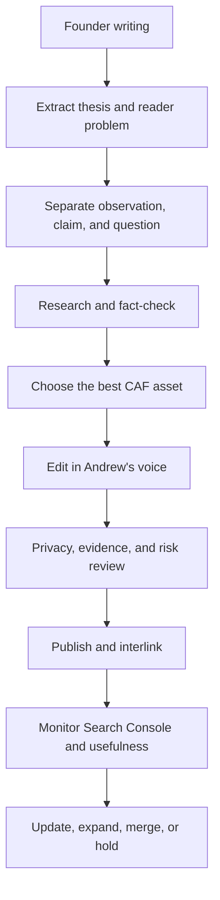

# CAF Content Engine

Last reviewed: 2026-09-03

## Purpose

Community Acquired Finance is an RN-led healthcare economics, healthcare finance, navigation, and healthcare-system publication supported by useful decision tools. Its scarce input is Andrew Ciccarelli's firsthand ability to notice where clinical work, money, insurance, operations, and family responsibility collide.

The content engine exists so Andrew can continue writing the book naturally while CAF turns only the strongest ideas into durable public assets. It is an editorial workflow, not an automatic publishing system.

## Source repository

Primary founder source: the Google Doc **Hospitals Are a Business — Rough Draft / Idea Dump**.

Rules:

- Treat the manuscript as read-only source material unless Andrew explicitly requests a manuscript edit.
- Preserve raw phrasing, questions, analogies, contradictions, and unfinished thinking. Do not “clean up” the source document as a side effect of web publishing.
- A founder observation is evidence of perspective and a useful question. It is not, by itself, proof of a policy, rate, prevalence, payment rule, or clinical fact.
- Never publish identifiable patient information, confidential employer information, or a distinctive fact pattern. Generalize or use a clearly labeled composite when operational experience is necessary.
- Never publish a new manuscript passage automatically.

## Operating loop

### 1. Capture without interrupting the book

Review only meaningful new manuscript sections. Record the passage location or a short internal description, the original thesis, the unusual phrase or analogy worth preserving, and the reader problem it could solve. Do not ask Andrew to rewrite the passage for SEO.

### 2. Split the material into evidence classes

For each candidate, create a small claim ledger:

| Element | Treatment |
|---|---|
| Firsthand observation | Preserve as perspective; generalize to protect privacy. |
| Analogy or question | Preserve when it improves understanding and is not misleading. |
| Factual claim | Verify independently with a current authoritative source. |
| Quantitative claim | Record value, year, population, payer, geography, denominator, and limitation. |
| Interpretation | Label through wording; do not disguise judgment as settled fact. |
| Clinical, coverage, legal, or financial conclusion | Use conservative language, controlling sources, and a clear verification boundary. |

### 3. Choose the asset before drafting

Every passage is screened for one or more assets:

- standalone article;
- update or introduction to an existing article;
- explanatory sidebar, FAQ, glossary entry, table, chart, diagram, or decision tree;
- calculator or decision-tool concept;
- downloadable guide or newsletter;
- internal-link opportunity, topic-cluster expansion, or social excerpt;
- product-demand signal to hold for later.

Publish nothing when the idea is generic, redundant, weakly supported, unsafe, too dependent on one anecdote, or unable to answer “why should this exist on CAF?” Prefer an update to the canonical article over a competing URL.

Score the ten strongest candidates from 1–5 on founder originality, insider operational insight, reader usefulness, mechanism importance, evidence strength, misconception value, discovery potential, internal-link potential, evergreen value, and CAF distinctiveness. The score supports judgment; it does not overrule the duplicate-intent gate, source risk, or the requirement that CAF would still value the piece with zero search traffic.

### 4. Research in source order

Prefer controlling or primary sources: CMS, Medicare.gov, Medicaid.gov, HHS and OIG, AHRQ, MedPAC, MACPAC, IRS, DOL, DOJ, GAO, BLS, Census, Federal Reserve, audited statements, Form 990/Schedule H, regulatory filings, state agencies, and peer-reviewed research. KFF, RAND, Commonwealth Fund, and other strong research organizations may add context when their methods and populations are stated.

For every material number, preserve the year, population, payer, measure, and limitation. Do not convert an aggregate margin into a claim about an individual patient, a one-month prior-authorization sample into a universal denial rate, or Original Medicare payment into a rule for every commercial contract.

### 5. Build the article around the reader

A major CAF explainer should normally contain:

1. a clear reader question and non-clickbait headline;
2. a direct answer near the beginning;
3. the founder thesis, analogy, or operational observation where useful;
4. a plain-English system map;
5. evidence, qualifications, and what varies;
6. the patient, hospital, payer, clinician/worker, and family perspectives when relevant;
7. practical questions or document checks;
8. a related CAF article, topic hub, and genuinely relevant tool;
9. author, publish/review dates, review scope, sources, correction route, and disclaimer.

Use the recurring CAF system lens when it adds clarity:

- Who makes the rule?
- Who pays?
- Who carries the risk?
- Who performs the work?
- Who absorbs the consequence when the process fails?

### 6. Protect voice without laundering errors

The target is **Andrew's thinking, professionally edited and rigorously researched**. Preserve memorable phrases and the tension in the original idea. Improve structure, precision, sourcing, context, and reader utility.

When a manuscript claim is wrong or oversimplified:

1. keep the underlying question or insight if it remains useful;
2. record the factual problem internally;
3. research the correct rule or evidence;
4. publish the corrected, qualified version;
5. never imply the raw manuscript was an authoritative source.

### 7. Apply publication gates

Before release, answer yes to each:

- Does the page provide a distinct answer CAF can credibly own?
- Is every material claim supported at the right level?
- Does wording distinguish “generally,” “may,” and “must” accurately?
- Are dates, populations, payer types, and limitations visible where they change meaning?
- Is every example de-identified, generalized, hypothetical, or composite?
- Would the article withstand scrutiny from a patient advocate, physician, nurse, hospital CFO, payer executive, and journalist?
- Does the article lead naturally to another useful resource without becoming a sales funnel?
- Are canonical metadata, Article schema, sitemap membership, sources, review dates, mobile layout, and internal links valid?
- Has the page received an explicit publisher disposition: ad-eligible, ad-free-sensitive, or ad-free-editorial?

### 8. Monitor and revise

Review acquisition at 28 and 90 days when enough data exist. Record sitewide totals from the Search Console Chart or Devices tabs; page and query tables are privacy-filtered and non-additive. Look for relevant non-branded queries, positions 5–20, impressions without clicks, intent mismatch, competing CAF URLs, and article-to-tool behavior.

Do not rewrite a distinctive thesis merely because the first sample is small. Improve title/snippet alignment and internal links first. Merge or redirect only when the pages serve the same reader job and current evidence supports one canonical destination.

## Initial book-to-CAF map

| Manuscript idea | Preserved intellectual material | Public asset | Research correction or expansion |
|---|---|---|---|
| The “$20 Tylenol” and restaurant-without-a-price analogy | The analogy, the separation between bedside care and financial visibility, and the question of what the charge actually represents | `/articles/20-dollar-tylenol-hospital-prices` | Separates gross charge, cash price, negotiated/allowed amount, payer payment, patient responsibility, and hospital cost; limits Medicare MS-DRG claims to applicable inpatient facility payment. |
| Hospitals as businesses and the meaning of nonprofit | The thesis that public expectations and business constraints collide | `/articles/what-nonprofit-hospital-actually-means` | Corrects “nonprofit means no profit”; adds 501(c)(3), Section 501(r), CHNA, financial-assistance, Schedule H, margin, and governance distinctions. |
| Why hospitals care about length of stay and a bed is more than furniture | “A bed is scarce staffed capacity, not furniture” and the patient/hospital tension around discharge | `/articles/why-hospitals-care-about-length-of-stay` | Qualifies national occupancy, payer-contract variation, Medicare IPPS, readmission incentives, ED boarding, and the shortest-safe-stay boundary. |
| “Just send them to rehab” | “A physician order is not a reservation. A referral is not an acceptance. Insurance coverage is not a bed. A bed is not necessarily a staffed bed.” | `/articles/why-just-send-them-to-rehab-is-not-simple` | Separates IRF, SNF, home health, and outpatient therapy; adds Original Medicare rules, MA authorization evidence, facility capability, appeal, network, and logistics gates. |
| The hospital as the place where failures elsewhere become visible | The hospital as a system “shock absorber,” plus the question of whether the institution holding a problem created the whole problem | `/articles/why-hospitals-become-the-systems-shock-absorber` | Narrows the metaphor into an emergency-access, boarding, staffed-flow, discharge-planning, and risk-transfer mechanism; explicitly preserves the counterargument that hospitals can create or worsen their own bottlenecks. |
| “Home with family” as a transfer of work rather than a complete plan | The bedside observation that medication, mobility, transportation, coordination, monitoring, and financial risk can move to a household | `/articles/home-with-family-is-not-a-free-care-plan` | Uses national eldercare data only for its defined age-65+ population; distinguishes intermittent Medicare home health from round-the-clock help; adds caregiver consent, capacity, job-protection, local-support, and backup-plan boundaries. |
| The bed can look inpatient while the payment classification is outpatient | The founder's recurring concern that labels inside healthcare carry consequences patients cannot see from the room | Updated canonical `/articles/observation-vs-inpatient-status` | Preserves the existing URL and separates formal admission, the two-midnight benchmark, Part A/Part B cost treatment, the Original Medicare SNF rule, ACO waivers, Medicare Advantage variation, MOON notice requirements, and the narrow status-change appeal. |
| Hospitals operate as businesses while communities expect infrastructure-like readiness | The grocery-store thought experiment and the tension that workers should understand the hospital is a business while leaders should remember it is not only a business | `/articles/hospitals-are-businesses-and-public-utilities` | Narrows “care before bank balance” to EMTALA's actual screening, stabilization, and transfer scope; adds readiness financing, ownership variation, 2024 margin evidence, price/accountability counterevidence, and limits of the public-utility analogy. |
| A doctor's recommendation does not decide insurance coverage | The founder's healthcare identity-crisis question about who actually controls care when clinician judgment, payer rules, facility capacity, and patient cost do not align | Updated canonical `/articles/prior-authorization-explained` | Separates recommendation, submission, authorization, network, delivery, and claim payment; adds scoped 2026 federal process rules, a bounded 2019 Medicare Advantage denial sample, legitimate utilization-management purposes, and plan-specific appeal limits. |
| A hospital can be profitable while one payer, service, or stay loses money | The founder's fixed-payment example and question about how profitable and essential services coexist inside one institution | `/articles/hospital-profitable-unprofitable-service` | Corrects the example to distinguish Medicare IPPS from other payer contracts; separates case, service-line, payer, operating, and total margins; adds allocation-method and cross-subsidy limits plus governance counterarguments. |

## Selected and deferred manuscript register — 2026-08-30

| Candidate | Decision | Reason and revisit trigger |
|---|---|---|
| Hospital as system shock absorber | **Publish** | Distinctive founder mechanism, strong reader value, and current EMTALA, AHRQ, discharge-planning, and MedPAC evidence. Revisit on new national boarding/capacity evidence or 2027-02-28. |
| Family as unpaid extension of the care team | **Publish, ad-free** | Distinctive care-transition insight with practical questions and strong BLS/AHRQ/Medicare/ACL/DOL evidence. Keep ad-free because it is consequential caregiver guidance; review by 2026-11-30. |
| Observation status and the invisible classification | **Improve existing canonical, ad-free** | Existing Search Console exposure and a clear canonical page made an in-place evidence upgrade more valuable than a new query-variant URL. Review current Medicare rules by 2026-11-30. |
| A hospital can be profitable while losing money on important services | **Hold for deeper research** | Valuable thesis, but a responsible article needs service-line accounting, allocation-method limits, payer-mix evidence, and examples that do not imply every hospital has the same cross-subsidy. |
| Healthcare's identity crisis: care system, labor system, public program, insurer, regulator, business, and political system | **Keep book-adjacent for now** | Strong umbrella argument but too broad for one useful canonical article. Revisit when a narrower reader question and evidence frame emerge. |
| Documentation as the system's operational record | **Hold for a narrower reader job** | The manuscript insight is real, but the best public format is unresolved and could drift into clinical or legal advice. Revisit around a specific billing, authorization, handoff, or patient-record decision. |

The register is not a content calendar. A held idea remains protected source material, not an obligation to create a URL.

## Selected and deferred manuscript register — 2026-09-03

| Candidate | Decision | Reason and revisit trigger |
|---|---|---|
| Hospitals as businesses with public-infrastructure expectations | **Publish** | Highest combined founder originality, institutional mechanism, evidence depth, and relationship to the existing hospital-economics cluster. Revisit on controlling EMTALA/payment evidence or 2027-03-03. |
| Doctor recommendation versus insurance coverage decision | **Improve existing canonical, ad-free** | The existing prior-authorization URL already owns the reader intent. A current, adversarial rebuild creates more value than a query variant and keeps consequential coverage guidance ad-free. Revisit by 2026-12-03 or on rule change. |
| Overall hospital profit versus service-line or case loss | **Publish** | Previously held evidence gap is now adequately bounded through CMS payment/cost-report sources, current MedPAC margins, limited cross-subsidy research, and explicit allocation/governance limitations. Revisit on current service-line evidence or 2027-03-03. |
| Documentation as the operational record | **Hold** | Strong founder insight, but the public reader job remains too broad and the topic can drift into clinical/legal advice. Revisit only around a specific authorization, coding, handoff, or record-correction problem. |
| Insurance finances access rather than deciding care alone | **Hold as synthesis** | Important but materially overlaps the rebuilt prior-authorization canonical. Revisit if a distinct multi-payer reader question emerges. |
| Every actor can be rational while the system result is irrational | **Keep book-adjacent** | Strong umbrella thesis, weak standalone boundary. Revisit when one mechanism can carry the article without repeating current flagships. |

The complete scored ten-candidate record is in `docs/editorial/2026-09-03-founder-candidate-pipeline.md`.

## Current baseline and ownership

- August 28, 2026 last-six-month Google Web export: **20 clicks and 3,449 impressions** in the sitewide Chart/Devices totals.
- Current publisher inventory before the September 3 release: **188 canonical routes**, **77 articles**, **42 explicitly ad-eligible routes**, **146 ad-free routes**, and **39 permanent redirects**. The release packet records the generated after-state rather than assuming it here.
- The Pages table totals are not a substitute for sitewide totals; the query table suppresses low-volume data.
- Early metrics are attention and utility signals, not proof of product-market fit or revenue readiness.
- Andrew owns final editorial judgment. AI can extract, research, edit, test, and propose; it cannot invent experience, approve its own unsupported claims, or publish manuscript additions automatically.

## Recurring review output

Each manuscript review should produce a short internal note with:

- sections reviewed and any new additions;
- candidate thesis and reader job;
- best asset type and existing canonical page, if any;
- source and privacy risks;
- publish, update, hold, or reject decision;
- internal links or visual/tool opportunities;
- owner and review trigger.

The default is **hold until editorially justified**, not publish because content exists.
