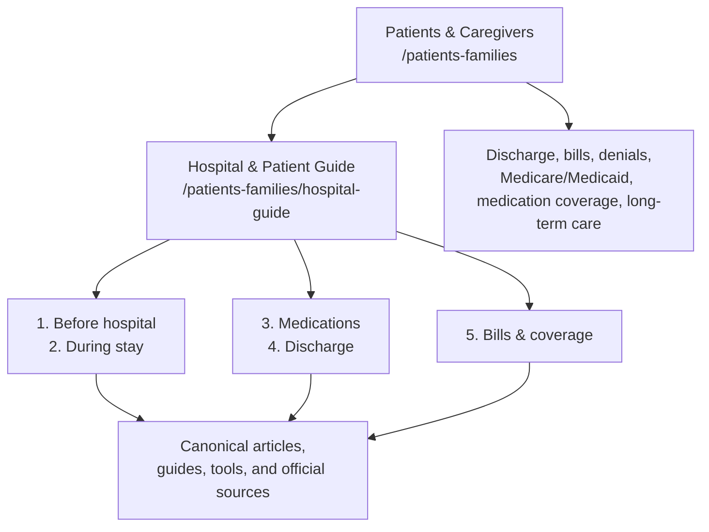

# Patient and Hospital Guide Architecture — July 16, 2026

## Decision summary

Community Acquired Finance will preserve `/patients-families` as the canonical patient-and-caregiver gateway and add one nested flagship hub at `/patients-families/hospital-guide`.

The flagship product name is **Hospital & Patient Guide**. Its role is to explain what commonly happens during a hospital stay, why it may happen, what comes next, and where cost or coverage questions fit. It is not a disease, diagnosis, or symptom encyclopedia.

The release uses `src/data/hospitalPatientGuide.ts` as the source of truth for the five stages, gateway journeys, canonical resources, launch state, sensitivity, review requirements, relationships, and official verification links. Existing indexed routes remain unchanged.

## Existing-resource inventory and disposition

| Resource | Current route | Current page role | Primary search intent | Patient journey stage | Decision | Duplicate or cannibalization risk | Clinical / insurance / legal / privacy risk | Launch priority |
|---|---|---|---|---|---|---|---|---|
| Patients & Caregivers gateway | `/patients-families` | Audience hub | patient and caregiver healthcare help | All stages | Keep and refresh; route into seven clear needs | Low if it remains the single audience gateway | Moderate: broad claims must stay qualified; no PHI collection | P0 |
| Hospital & Patient Guide | `/patients-families/hospital-guide` | Flagship collection hub | understand what happens during a hospital stay | All stages | Launch as the one nested hospital-stay hub | Low when it summarizes and links rather than reproducing articles | High: clinical, coverage, and legal topics; ad-free and non-interactive | P0 |
| Why an ER Visit Can Be So Expensive | `/articles/why-er-visit-is-expensive` | Article | why emergency room visits cost so much | Before hospital | Keep; surface before-hospital cost context | Can overlap with multiple-bills article; distinguish visit-cost stack from billing entities | Moderate billing and network qualification | P1 |
| Observation vs. Inpatient Status | `/articles/observation-vs-inpatient-status` | Article | observation versus inpatient status | During stay | Keep; link from status stage | High if a second status explainer is created; do not duplicate | High Medicare, notice, appeal, and plan-rule sensitivity | P0 |
| Observation vs. Inpatient Status Guide | `/tools/observation-vs-inpatient-status-guide` | Guided tool | questions to ask about hospital status | During stay | Keep; distinguish tool from explainer | Moderate article/tool overlap; tool prepares questions only | High coverage/legal sensitivity; constrained inputs; no PHI analytics | P0 |
| Hospital Discharge Coverage Guide | `/insurance/hospital-discharge-coverage` | Long-form guide and workflow | insurance coverage after hospital discharge | Discharge and recovery | Keep; make the primary discharge path | Moderate overlap with Medicare checklist; distinguish broad coverage from Medicare verification | High payer, Medicare, authorization, and appeal sensitivity | P0 |
| Hospital Discharge Medicare Checklist | `/tools/hospital-discharge-medicare-checklist` | Checklist | Medicare questions before discharge | Discharge and recovery | Keep; surface beside coverage guide | Moderate overlap with discharge guide; checklist remains Medicare action layer | High Medicare and plan-rule sensitivity; ad-free | P0 |
| Hospital Discharge Medicare Quick Guide | `/guides/hospital-discharge-medicare` | Long-form and printable guide family | Medicare, rehab, and long-term care after discharge | Discharge and recovery | Keep; link as deeper reading, not another hub | Moderate overlap with discharge guide; preserve long-form/print role | High Medicare/Medicaid freshness and coverage risk | P1 |
| Does Medicare Cover Rehab After a Hospital Stay? | `/articles/does-medicare-cover-rehab-after-hospital-stay` | Article | Medicare rehab coverage after hospitalization | Discharge and recovery | Keep | Overlaps with `short-term-rehab-after-hospital`; preserve both routes pending Search Console evidence and content review | High Original Medicare/MA distinction and coverage sensitivity | P1 |
| Short-Term Rehab After the Hospital | `/articles/short-term-rehab-after-hospital` | Article | short-term skilled rehab after hospitalization | Discharge and recovery | Keep for now; refresh and differentiate | High cannibalization risk with Medicare rehab article | High clinical/coverage sensitivity | P2 |
| Does Medicare Cover Long-Term Care? | `/articles/does-medicare-cover-long-term-care` | Article | Medicare long-term-care coverage | Discharge and recovery | Keep; link to Medicaid pathway | Moderate overlap with custodial-care article | High Medicare/Medicaid/state-rule sensitivity | P1 |
| Medical Bill Review Toolkit | `/insurance/medical-bill-review-toolkit` | Flagship guided toolkit | how to review a medical bill | Bills and coverage | Keep as canonical bill-resolution center | Low if other tools remain narrower steps | High billing/collections/legal/privacy sensitivity; local storage only | P0 |
| Medical Bill Review Flow | `/tools/medical-bill-review-flow` | Guided tool | step-by-step medical bill review | Bills and coverage | Keep as a narrower first-pass workflow | Moderate overlap with toolkit; make toolkit the complete destination | High billing and appeal qualification; constrained inputs | P1 |
| EOB-to-Bill Match Checker | `/tools/eob-to-bill-match-checker` | Tool | bill does not match EOB | Bills and coverage | Keep | Low; distinct document-comparison job | Moderate billing/privacy risk; do not collect member or claim identifiers | P0 |
| How to Read an EOB | `/articles/how-to-read-an-eob` | Article | how to understand an EOB | Bills and coverage | Keep | Low; explanation precedes document-matching tool | Moderate billing and plan-rule qualification | P1 |
| Why One Hospital Visit Can Create Multiple Bills | `/articles/why-one-hospital-visit-can-create-multiple-bills` | Article | why hospital bills arrive separately | Bills and coverage | Keep | Moderate overlap with ER-cost and facility-fee articles; distinguish billing entities | Moderate billing/network risk | P1 |
| Facility Fee vs. Professional Fee | `/articles/facility-fee-vs-professional-fee` | Article | facility fee versus professional fee | Bills and coverage | Keep | Low if limited to fee distinction | Moderate billing and site-of-service qualification | P1 |
| In-Network Hospital and Out-of-Network Bills | `/articles/in-network-hospital-out-of-network-bills` | Article | out-of-network provider at in-network hospital | Bills and coverage | Keep | Low | High federal/state legal and network-protection sensitivity | P2 |
| Prior Authorization Next-Step Guide | `/tools/prior-authorization-next-step-guide` | Guided tool | what to do after authorization delay or denial | Bills and coverage | Keep as canonical next-action route | Moderate overlap with prior-authorization article; tool organizes action | High plan, state/federal appeal, urgency, and deadline sensitivity | P0 |
| Hospital Financial Assistance | `/articles/check-hospital-financial-assistance-before-paying` | Article | hospital charity care or financial assistance | Bills and coverage | Keep | Low | High hospital-policy, nonprofit-hospital, state, collections, and legal sensitivity | P1 |
| Medicare and Medicaid Eligibility Check | `/tools/medicare-medicaid-eligibility-check` | Guided tool | could Medicare or Medicaid help | Discharge / long-term care / coverage | Keep as canonical screening pathway | Low if it never claims official eligibility | High federal/state eligibility and privacy sensitivity; no exact financial or medical inputs | P0 |
| Medication Coverage Checklist | `/insurance/medication-coverage-checklist` | Checklist | check whether a prescription is covered | Before hospital / medications / discharge | Keep | Low; coverage-only, not clinical medication advice | High plan-specific coverage sensitivity; do not collect medication names in analytics | P1 |
| Out-of-Pocket Maximum Estimator | `/tools/out-of-pocket-max-estimator` | Calculator | remaining annual out-of-pocket exposure | Bills and coverage | Keep | Low | Moderate estimate and plan-limit risk; no guarantee of liability | P2 |

## New launch content

Two foundational articles were added—within the requested limit of two to four:

1. `/articles/why-am-i-getting-a-blood-thinner-in-the-hospital`
2. `/articles/why-did-the-hospital-stop-or-change-my-home-medications`

Both use exact patient questions as titles, provide a direct answer near the top, distinguish common practice from patient-specific decisions, list variables and exceptions, include questions for the bedside team, identify information to verify, explain when to notify the bedside team promptly, link back to the hub, show official sources, identify Andrew Ciccarelli, BSN, RN as author, state that no independent credentialed reviewer is claimed, and default to ad-free governance.

Current authoritative sources verified for this release include CDC healthcare-associated venous thromboembolism guidance, National Library of Medicine MedlinePlus drug information, and the Joint Commission medication-reconciliation standard interpretation. Founder voice notes informed topic selection only and were not treated as evidence.

## Single source of truth

`src/data/hospitalPatientGuide.ts` defines:

- stable resource and stage IDs;
- canonical routes;
- patient-journey stage;
- page role;
- existing, new, or proposed status;
- launch status and priority;
- primary search intent and audience;
- clinical and insurance/legal sensitivity;
- review requirements;
- related tools and articles;
- official verification resources;
- the seven choices rendered on `/patients-families`;
- the five stages rendered on `/patients-families/hospital-guide`.

`ArticlePage.tsx` consults this configuration for hospital-guide next steps. It does not add slug-by-slug hospital article branches.

## Missing content

### High-value low-risk workflow explanations

- Emergency department vs. urgent care vs. freestanding emergency department
- What to bring to the hospital
- How to prepare an accurate medication list
- What a hospitalist does
- What case managers and social workers do
- Why fall precautions are used
- Why telemetry is used
- Why discharge can take time

### Foundational clinical explainers requiring controlled review

- Why can’t I eat or drink before a test or procedure?
- Why does the hospital keep drawing blood?
- Why is insulin sometimes used temporarily in the hospital?
- Why are antibiotics sometimes started before final test results?
- What should I ask before accepting or declining a new medication?

### Coverage and post-acute gaps

- What happens when the proposed discharge destination is unavailable?
- Skilled nursing versus inpatient rehabilitation versus custodial care
- Home health expectations versus private-duty or custodial help
- Ambulance and non-emergency transport cost questions
- Facility, clinician, lab, radiology, anesthesia, pathology, and ambulance billing map

## Duplicate and cannibalization risks

1. **Medicare rehab:** `does-medicare-cover-rehab-after-hospital-stay` and `short-term-rehab-after-hospital` are close. Preserve both until Search Console impressions, backlink value, and content differentiation are reviewed. Prefer one coverage-answer article and one practical facility/recovery guide.
2. **Long-term care:** `does-medicare-cover-long-term-care` and `long-term-care-and-custodial-care` may overlap. Keep established URLs; differentiate Medicare coverage intent from care-type education.
3. **Medical bills:** the toolkit, flow, EOB checker, and articles are complementary only when their jobs remain explicit: hub/toolkit, guided sequence, document comparison, and explanation.
4. **Hospital status:** the article explains the concept; the tool prepares fixed questions. Do not publish another status explainer.
5. **Discharge:** the coverage guide is the broad action destination; the Medicare checklist and long-form guide are narrower and deeper. Do not create a second discharge hub.

## Clinical, insurance, legal, and privacy risk controls

### Clinical

- No diagnosis, dose recommendation, or patient-specific safety determination.
- No instruction to independently start, stop, skip, substitute, or change medication.
- Use “hospitals commonly,” “a clinician may,” and “the reason depends on.”
- Hospitalized readers are told to notify the bedside team promptly about sudden or concerning changes.
- No physician-reviewed or medically reviewed claim is made.

### Insurance and legal

- No coverage guarantee.
- Original Medicare, Medicare Advantage, Medicaid, commercial plans, facility policy, and state rules remain distinct.
- Rights, denial, and appeal content points readers to written notices and current official sources and does not claim universal rights.

### Privacy and analytics

- The release adds no form and collects no patient name, date of birth, diagnosis, symptom text, medication list, claim/member/account number, provider, hospital, or medical record.
- Analytics are consent-gated and limited to fixed `stage_id`, fixed `item_id`, sanitized destination path, and fixed official-resource ID.
- The shared analytics sanitizer now removes medication, drug, symptom, provider, hospital, patient, member, claim, and date fields if a future caller attempts to send them.

### Advertising

- `/patients-families` and `/patients-families/hospital-guide` are ad-free hubs.
- The new clinical articles are indexable but are not in the explicit advertising allowlist.
- Interactive patient workflows remain ad-free.

## Launch priority

### P0 — included in this release

- Refresh `/patients-families` into seven clear journeys.
- Launch the nested Hospital & Patient Guide.
- Organize existing resources into five stages.
- Publish two foundational medication articles.
- Add canonical metadata, breadcrumb JSON-LD, sitemap/prerender registration, internal links, governance, and privacy-safe analytics.

### P1 — next controlled wave

- Publish NPO and repeated-blood-draw explainers after clinical source review.
- Add “what to bring” and “accurate medication list” pages.
- Clarify the rehab and long-term-care article pairs using Search Console evidence.
- Add hub backlinks to additional relevant Medicare and observation pages.

### P2 — later

- Build a printable hospital-stay question sheet after accessibility and clinical review.
- Add a local-only discharge medication reconciliation checklist with no medication names or free text.
- Evaluate a caregiver handoff checklist that stores nothing and sends no answers to analytics.

## Deferred backlog

### 1. Low-risk hospital workflow explainers

- What does a hospitalist do?
- Why am I on telemetry?
- Why are fall precautions used?
- What do case managers and social workers do?
- Why can discharge take several hours?

### 2. Medication explainers

- Why is insulin used temporarily?
- Why are antibiotics started before final results?
- How to ask about a new medication, refusal, side effects, and follow-up
- Why was I prescribed a statin when my cholesterol is normal? — blocked until cardiovascular risk, secondary prevention, diabetes, vascular disease, risk calculators, monitoring, shared decision-making, and single-result limitations can be reviewed together

### 3. Discharge and rehabilitation

- Skilled nursing versus inpatient rehabilitation
- What happens when no facility accepts the referral?
- Home health versus custodial help
- Equipment delivery and backup planning

### 4. Bills and coverage

- Ambulance and transport billing
- Hospital-based clinic facility fees
- Financial assistance documentation and collections timing by applicable jurisdiction

### 5. Topics requiring clinical review

- NPO instructions
- Repeated blood draws
- Temporary insulin
- Empiric antibiotics
- Medication refusal and alternative planning

### 6. Topics requiring legal or state-specific review

- Discharge appeal rights
- State balance-billing protections
- Collections and credit-reporting timelines
- Medicaid long-term-services eligibility and estate-recovery rules

### 7. Future interactive tools

- Local-only hospital question checklist
- Local-only discharge medication reconciliation checklist using status toggles rather than medication text
- Local-only caregiver handoff checklist
- Hospital bill entity mapper using fixed selections only

## Final architecture

The hub owns broad “understand a hospital stay” intent. Individual articles own narrow patient questions. Tools own a defined action or checklist. Existing canonical URLs remain the final destinations.

