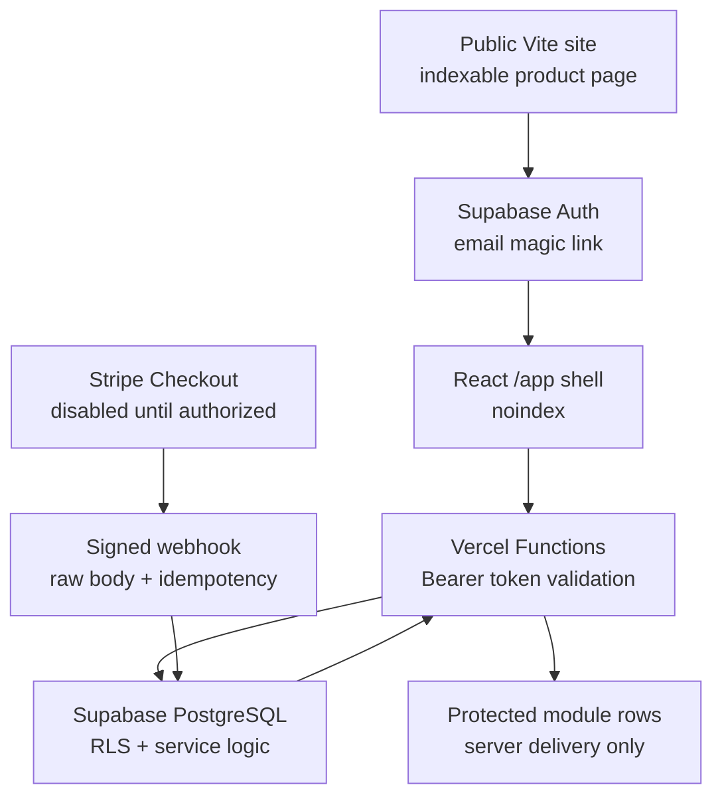
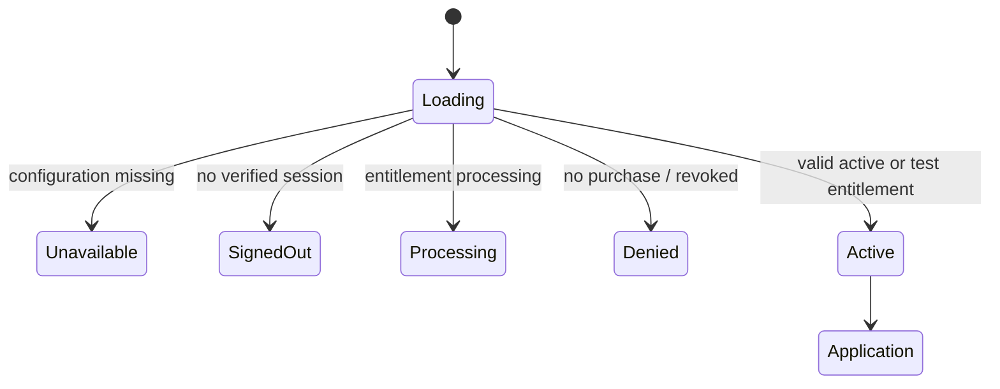
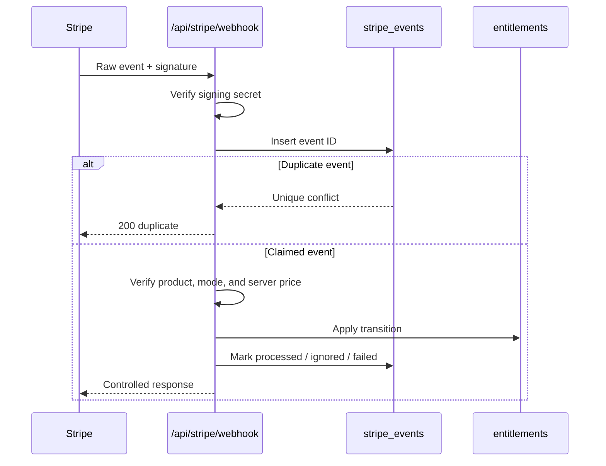

# Healthcare Worker Benefits Decision System architecture

Last updated: July 24, 2026

This document is the technical source of truth for the Community Acquired Finance account-based premium foundation. It replaces the former PDF/decision-pack and Lemon Squeezy/Redis workspace designs.

## Product and release posture

- Canonical product key: `healthcare-worker-benefits-decision-system`
- Public route: `/products/healthcare-worker-benefits-decision-system`
- Application namespace: `/app`
- Primary application route: `/app/benefits-decision`
- Intended identity and database provider: Supabase
- Intended payment provider: Stripe Checkout
- Intended transactional email provider: Resend
- Hosting: existing React/Vite site and short-lived Vercel Functions
- Commerce status: disabled by default
- Honest readiness: foundation only until external configuration and end-to-end validation are complete

The expected $29 one-time price is a planning target, not an active offer. A browser success URL, client flag, local-storage value, or application route never grants authority.

## System diagram

## Public versus protected boundary

| Surface | Indexing | Data or content allowed |
|---|---:|---|
| Public product page | Indexable | Product problem, audience, module names, representative interface, privacy limits, availability |
| `/sign-in`, `/account`, `/access-processing` | Noindex, no-store | Authentication and access-state orientation only |
| `/app` and `/app/*` | Noindex, no-store | Generic client renderer after authorization |
| `/api/access/*` | Private, no-store | Server-derived entitlement status |
| `/api/premium/content` | Private, no-store | Protected module definition only after all checks |
| `/api/workspaces*` | Private, no-store | Validated workspace data scoped to authenticated user |
| `/api/checkout` | Private, no-store | Server-created Stripe Checkout URL only when explicitly enabled |
| `/api/stripe/webhook` | Private, no-store | Signed Stripe event processing |
| Public assets and Vite chunks | Public | No proprietary module definitions, question libraries, workspace records, or user output |

Public copy may describe the eight modules, but the complete written prompts, detailed professional question sets, protected module definitions, saved workspace state, and decision outputs do not belong in public static assets.

`src/premium/dev/demoModules.ts` contains non-production development fixtures. Its sentinel must be absent from every production bundle. Vite replaces `import.meta.env.DEV` with `false` and removes the dynamic import during production builds. `npm run premium:boundary-check` verifies both the protected-server sentinel and development-content sentinel are absent from `dist`.

## Authentication flow

1. The public product page remains usable without an account.
2. `/sign-in` checks the public Supabase URL, anonymous key, and explicit client authentication flag.
3. If configuration is missing, the route shows a controlled unavailable state.
4. When enabled, `signInWithOtp` requests an email magic link using PKCE.
5. Supabase returns a session to the browser.
6. The client sends the access token in an `Authorization: Bearer` header.
7. Each private function calls Supabase `auth.getUser(token)` before reading authority-bearing state.
8. Authentication and entitlement are checked separately.
9. Signing out clears the Supabase session.

Mock authentication is permitted only when the Vite development server is running and `VITE_PREMIUM_DEV_MOCK_AUTH=true`. It creates no production session and cannot call production APIs. Production release checks fail if any mock or entitlement-bypass flag is enabled.

## Protected route flow

The client wrapper is a user-experience control, not the security boundary. Each server function repeats authentication, entitlement, product, module, and ownership checks as applicable.

## Checkout flow

`POST /api/checkout`:

1. Accepts only `POST`.
2. Checks same-origin for browser requests.
3. Requires `PREMIUM_CHECKOUT_ENABLED=true`.
4. Requires safe feature-flag state, Supabase server configuration, entitlement enforcement, and Stripe configuration.
5. Requires an authenticated Supabase user.
6. Accepts only the product key.
7. Rejects browser-supplied price IDs, success URLs, and cancellation URLs.
8. Resolves the exact Stripe price from the server environment.
9. Creates or retrieves the Stripe customer tied to the authenticated user.
10. Places the user ID and product key in Checkout Session and PaymentIntent metadata.
11. Creates a one-time payment session with controlled site URLs.
12. Records a non-authoritative `processing` entitlement state.
13. Returns the hosted Checkout URL.

Checkout is currently disabled. No session is created without valid Stripe test configuration and the explicit server flag. Live mode additionally requires `PREMIUM_PRODUCTION_CHECKOUT_AUTHORIZED=true`.

## Webhook and entitlement flow

Supported minimum events:

- `checkout.session.completed`
- `checkout.session.async_payment_succeeded`
- `checkout.session.async_payment_failed`
- `payment_intent.payment_failed`
- `charge.refunded`

Successful access is granted only after a signed successful payment event for the exact server-mapped price. Refunds mark the entitlement `refunded`. Failure events revoke non-valid access. Duplicate Stripe event IDs are acknowledged without applying the transition again.

Entitlement statuses:

- `active`
- `processing`
- `refunded`
- `revoked`
- `expired`
- `test`

The `(user_id, product_key)` unique constraint prevents duplicate grants. Stripe checkout-session and payment-intent identifiers have partial unique indexes.

## Workspace model

The `workspaces` table stores:

- UUID
- authenticated user UUID
- product key
- generic title
- `active`, `completed`, or `archived` status
- progress percentage
- versioned, validated JSON state
- creation and update timestamps

The version 1 state contains:

- active module key
- completed module keys
- answer map with bounded primitive values
- bounded assumptions
- final user-selected decision
- update timestamp

No upload field exists. Server handlers validate state using the shared Zod contract before saving. All service-role queries include the authenticated `user_id` and product key to defend against insecure direct object references. Database RLS independently limits user-owned workspace operations to users with an active or test entitlement.

## Database and RLS model

Migration: `supabase/migrations/202607240001_premium_system_foundation.sql`

Tables:

- `profiles`
- `products`
- `entitlements`
- `workspaces`
- `stripe_events`
- `premium_modules`
- `premium_admins`

Key RLS rules:

- Authenticated users may select only their own profile.
- Authenticated users may select only their own entitlement.
- Authenticated users may select, insert, update, and delete only their own workspaces while a valid entitlement exists.
- Authenticated and anonymous roles cannot write entitlements.
- Ordinary users have no policy for `products`, `premium_modules`, `stripe_events`, or `premium_admins`.
- Administrative membership is explicit in `premium_admins`; only trusted service-role operations may provision it.
- Service functions still scope queries explicitly even though the service role can bypass RLS.

## Protected content delivery

`GET /api/premium/content?productKey=...&moduleKey=...` returns a module definition only after:

1. Supabase and entitlement services are configured.
2. The bearer token identifies a real user.
3. The server registry recognizes the product.
4. The server registry authorizes the module for the product.
5. The user has an active or test entitlement.
6. The database product status is `active` or `test`.
7. A protected module row exists for that product, module, and status.

Protected modules are seeded from an ignored local path under `private-premium-content/` using `npm run premium:seed-modules -- <path>`. The source definitions are not committed. Active seeding requires a second explicit production authorization flag.

## Calculation and decision-output model

Client calculation utilities are transparent, testable logic rather than proprietary written content:

- annual compensation with base and conditional components
- known and estimated benefit totals with unknown/non-cash counts
- low-, expected-, and high-use health-plan scenarios
- retirement match, nonelective contribution, vesting, and potential forfeiture
- transparent weighted subjective ratings
- progress
- system observations

The decision brief is rendered in the browser and optimized for printing. It includes the user-selected decision, workflow progress, assumptions, observations, and unresolved verification questions. Browser printing is an output; it is not the core product.

## Analytics taxonomy

All events use `trackSiteEvent`, respect existing consent, and pass through the shared sensitive-key sanitizer.

| Event | Safe properties only |
|---|---|
| `premium_product_page_viewed` | fixed product key |
| `premium_system_preview_viewed` | fixed preview type |
| `premium_early_access_selected` | fixed action and source |
| `premium_sign_in_started` | fixed interaction state |
| `premium_workspace_created` | fixed product key |
| `premium_module_started` | fixed module key |
| `premium_module_completed` | fixed module key |
| `premium_decision_brief_viewed` | no user values |
| `premium_print_selected` | fixed output type |
| `premium_checkout_unavailable` | fixed reason code when implemented at UI boundary |
| `premium_checkout_started` | fixed product key |
| `premium_entitlement_activated` | fixed product key and test/live classification only |

Never send names, emails, employers, roles, compensation, premiums, deductibles, account contributions, notes, medical information, health information, dates supplied by the user, Stripe IDs, or workspace answer values.

## Failure modes

| Failure | Customer behavior |
|---|---|
| Authentication configuration missing | Public site works; account and app show unavailable |
| Database configuration missing | Access and persistence return controlled 503 responses |
| Session missing or expired | Signed-out state; no protected content |
| Entitlement missing | Product access required |
| Entitlement processing | `/access-processing` polls server status |
| Entitlement revoked/refunded/expired | Access denied with support path |
| Workspace ID belongs to another user | Generic not-found response |
| Workspace deleted | Generic not-found response |
| Invalid module state | Bounded 400 response with no internal details |
| Save or network failure | Unsaved state remains visible; navigation warning stays active |
| Checkout disabled | Generic `checkout_disabled` response |
| Stripe configuration missing | Controlled unavailable response |
| Webhook signature invalid | 400; no event or entitlement mutation |
| Duplicate webhook | 200 duplicate acknowledgement; no second mutation |
| Print failure | Browser print control remains non-authoritative; user may retry |

Customer responses never contain stack traces, database errors, raw Stripe errors, secrets, or submitted workspace details. Private API responses use `no-store`.

## Security assumptions and checks

- Browser code is inspectable and does not hold entitlement authority.
- Server price mapping is the only accepted Stripe price.
- Success and cancellation URLs are server controlled.
- Raw Stripe signatures are verified before processing.
- Event IDs are unique and idempotent.
- Service-role secrets never use `VITE_`.
- Production source maps are not enabled by the Vite configuration.
- Private routes are absent from sitemap, public structured-data collections, and public prerender inventories.
- Private route and API headers are no-store/noindex.
- User-entered values are not included in metadata, structured data, URLs, or analytics.
- The first release has no document uploads.
- Missing flags and environment variables disable capabilities.
- `npm run premium:release-check` rejects unsafe production flags.
- `npm run premium:boundary-check` checks production output for protected sentinels and server-secret variable names.

## Vercel Hobby compatibility

Functions are short-lived, stateless, and request-driven. No cron, long-running worker, paid firewall, Pro observability, enterprise authentication, or deployment-protection feature is required. Supabase and Stripe perform durable state and payment processing.

Future traffic, webhook volume, compliance, support, retention, or audit requirements may justify paid infrastructure. That is a later operational decision, not a launch dependency in this foundation.

## Current implementation status

Implemented in code:

- canonical public page and permanent legacy redirect
- noindex account/application routes
- Supabase authentication abstraction and default-deny route wrapper
- database migration and RLS contract
- protected content endpoint and server-only seed pattern
- user-scoped workspace APIs
- Stripe Checkout and webhook foundations
- entitlement transitions and idempotency
- generic application shell, forms, calculations, progress, save handling, and print brief
- release, readiness, schema, boundary, unit, browser, accessibility, and smoke checks

Disabled or external:

- production Supabase project and applied migration
- production authentication
- protected production module rows
- Stripe test product, price, keys, and webhook
- test purchases, refunds, and revocations
- live checkout authorization
- real paid access

See `docs/premium-system-status.md` for the current release record.
